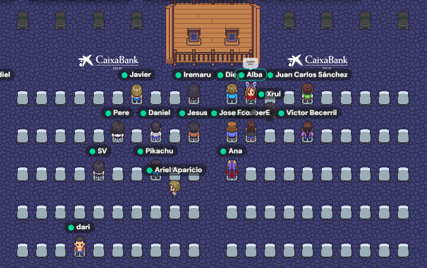
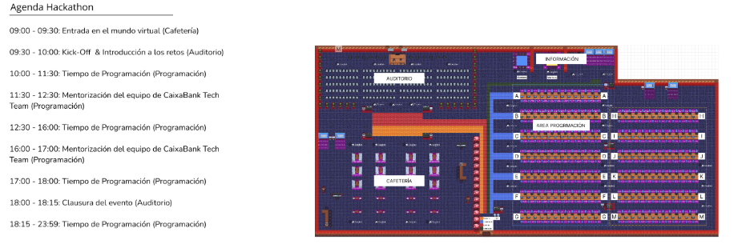

# Blockchain_Backend

## 🚀 Descripción
Este proyecto es un **BACKEND** diseñado para una plataforma de comercio de criptomonedas y blockchain, desarrollado como parte de un **HACKATÓN DE LA CAIXA TECH**.  
Permite gestionar wallets, realizar transacciones, simular una blockchain y ejecutar contratos inteligentes.


## 🏗️ Arquitectura del Proyecto
La arquitectura está organizada en varios módulos que colaboran para ofrecer la funcionalidad completa de la plataforma:

- **Autenticación y Gestión de Sesiones**: Permite gestionar el registro, inicio de sesión y sesiones de usuarios de manera segura.
- **Gestión de Wallets**: Crea, actualiza y sincroniza el saldo de las wallets.
- **Transacciones**: Facilita el envío y la recepción de fondos entre wallets, con validación basada en contratos inteligentes.
- **Simulación de Blockchain**: Valida y almacena las transacciones en bloques, emulando el funcionamiento de una blockchain.
- **Firma Digital**: Usa criptografía para asegurar la integridad de las transacciones y contratos inteligentes.
- **Contratos Inteligentes**: Ejecuta contratos con reglas de negocio definidas, validadas con firma digital.

## ⚙️ Tecnologías Utilizadas

- **Java 17** + **Spring Boot**: Framework principal para la implementación del backend, que proporciona un entorno robusto y eficiente.
- **Spring Security**: Módulo para gestionar la autenticación y autorización de los usuarios.
- **JPA (Hibernate)**: Gestión de la base de datos para persistencia y consulta de los datos.
- **RSA**: Criptografía para la firma digital.
- **Docker**: Contenedorización de la aplicación, lo que facilita su despliegue y escalabilidad.
- **SpEL (Spring Expression Language)**: Para la validación dinámica de contratos inteligentes.

## 🔗 Endpoints Principales

### 🏠 Autenticación
| Método | Endpoint               | Descripción               |
|--------|------------------------|---------------------------|
| POST   | /auth/register          | Registro de usuario       |
| POST   | /auth/login             | Inicio de sesión          |
| GET    | /auth/check-session     | Verificación de sesión    |
| POST   | /auth/logout            | Cerrar sesión             |

### 💰 Wallets
| Método | Endpoint               | Descripción               |
|--------|------------------------|---------------------------|
| GET    | /wallet/create          | Crear una nueva wallet    |
| GET    | /wallet/generate-keys   | Generar claves para wallet|
| GET    | /wallet/transactions    | Consultar transacciones   |
| GET    | /wallet/balance         | Consultar saldo de wallet |
| POST   | /wallet/buy             | Comprar un activo         |
| POST   | /wallet/sell            | Vender un activo          |

### ⛓️ Blockchain
| Método | Endpoint               | Descripción               |
|--------|------------------------|---------------------------|
| POST   | /blockchain/mine        | Minar un nuevo bloque     |
| GET    | /blockchain             | Ver todos los bloques     |
| GET    | /blockchain/validate    | Validar la blockchain     |

### 📝 Contratos Inteligentes
| Método | Endpoint               | Descripción               |
|--------|------------------------|---------------------------|
| POST   | /contracts/create       | Crear un nuevo contrato   |
| GET    | /contracts/validate/{id}| Validar un contrato       |

### 🏪 Mercado
| Método | Endpoint               | Descripción               |
|--------|------------------------|---------------------------|
| GET    | /market/prices          | Precios de activos        |
| GET    | /market/price/{symbol}  | Precio de un activo       |

### 📊 Panel de Control
| Método | Endpoint               | Descripción               |
|--------|------------------------|---------------------------|
| GET    | /api/dashboard          | Ver panel de usuario      |


## 🧪 Pruebas

Puedes ejecutar las pruebas unitarias y de integración del proyecto con el siguiente comando:

```bash
mvn test 
```

## 📂 Estructura del Repositorio

```plaintext
📦 Blockchain_Backend
├── 📁 blockchain                                  # Módulo principal de la aplicación
│   ├── 📁 .mvn                                    # Archivos de configuración de Maven
│   │   └── 📁 wrapper                             # Wrapper de Maven
│   ├── 📁 keys                                    # Claves y configuraciones relacionadas con criptografía
│   ├── 📁 src
│   │   ├── 📁 main                                # Código fuente principal
│   │   │   ├── 📁 java
│   │   │   │   └── 📁 com
│   │   │   │       └── 📁 hackathon
│   │   │   │           └── 📁 blockchain
│   │   │   │               ├── 📁 config          # Configuración del proyecto
│   │   │   │               ├── 📁 controller      # Endpoints de la API REST
│   │   │   │               ├── 📁 dto             # Data Transfer Objects
│   │   │   │               ├── 📁 exceptions      # Excepciones personalizadas
│   │   │   │               ├── 📁 model           # Definición de clases (Wallet, Transaction, Block...)
│   │   │   │               ├── 📁 repository      # Interfaces para acceso a datos
│   │   │   │               ├── 📁 response        # Respuestas y objetos asociados
│   │   │   │               ├── 📁 runner          # Ejecutores o inicializadores de procesos
│   │   │   │               ├── 📁 service         # Lógica de negocio y procesamiento de datos
│   │   │   │               └── 📁 utils           # Funciones auxiliares
│   │   │   └── 📁 resources                       # Archivos de configuración adicionales 
│   │   └── 📁 test                                # Tests unitarios y de integración
│   │       └── 📁 java
│   │           └── 📁 com
│   │               └── 📁 hackathon
│   │                   └── 📁 blockchain
│   ├── 📁 target                                  # Archivos generados por el build de Maven
│   │   ├── 📁 classes                             # Archivos compilados y clases de la aplicación
│   │   ├── 📁 generated-sources                   # Fuentes generadas automáticamente
│   │   ├── 📁 generated-test-sources              # Fuentes generadas para tests
│   │   ├── 📁 maven-status                        # Estado de compilación de Maven
│   │   ├── 📁 surefire-reports                    # Informes de pruebas
│   │   └── 📁 test-classes                        # Clases de prueba compiladas
├── 📁 mundovirtual                                # Imágenes de la experiencia en el hackatón de la Caixa Tech
├── 📜 Dockerfile                                  # Configuración para el contenedor Docker
├── 📜 docker-compose.yml                          # Orquestación de servicios Docker
├── 📜 application.properties                      # Configuración de Spring Boot
├── 📜 README.md                                   # Documentación del proyecto
```

## Mundo Virtual



## Agenda del Hackatón


